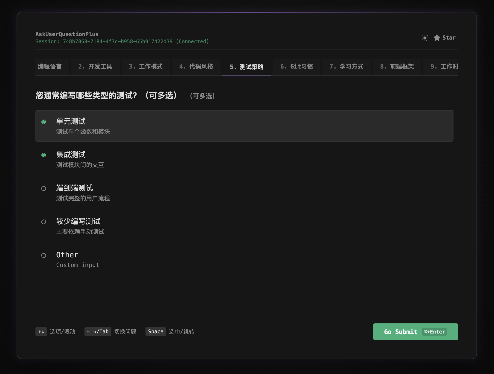

# AskUserQuestionPlus

[](https://opensource.org/licenses/MIT)
[](https://www.npmjs.com/package/ask-user-question-plus)

A MCP server (Streamable HTTP) for asking user questions via a web interface, inspired by the Claude Code AskUserQuestion Tool.

> 🌟 Supports Claude Code, Codex, and Gemini CLI!



<div align="center">

[**English**](#english) | [**中文**](#chinese)

</div>

---

<a id="chinese"></a>

## ✨ 特性

- **🎨 精美界面**：Claude Code AskUserQuestions 风格样式，支持暗/浅色主题适配
- **⌨️ 全键盘操作**：支持方向键、Tab、Space、Enter 快捷键，操作流畅
- **📊 丰富交互**：支持单选、多选、推荐选项标记以及自定义输入（Other）
- **🔄 实时通信**：基于 WebSocket 的实时消息传递，响应迅速
- **⏱️ 超时保护**：可配置会话超时时间（默认 10 分钟）
- **📈 高度可扩展**：支持 1-20 个问题，每个问题选项数量不限

## 🚀 部署

### 启动参数

| 参数               | 说明         | 默认值           | 示例               |
| :----------------- | :----------- | :--------------- | :----------------- |
| `--timeout=<毫秒>` | 会话超时时间 | 600000 (10 分钟) | `--timeout=300000` |
| `--port=<端口>`    | 监听端口     | 3456             | `--port=8080`      |

### 前台运行

```bash
npx ask-user-question-plus

# 自定义端口和超时
npx ask-user-question-plus -- --port=3456 --timeout=600000
```

### 后台运行（推荐）

#### 使用 pm2

> 需先安装 pm2: `npm install -g pm2`

```bash
pm2 start "npx ask-user-question-plus" --name ask-user-question-plus-service

# 带参数启动
pm2 start "npx ask-user-question-plus -- --port=3456 --timeout=600000" --name ask-user-question-plus-service

# 停止服务
pm2 stop ask-user-question-plus-service

# Windows
pm2 start cmd --name ask-user-question-plus-service -- /c npx ask-user-question-plus
```

#### 使用 Docker

```bash
docker compose up -d
```

## ⚙️ 配置

### Claude Code

```bash
claude mcp add -s user -t http AskUserQuestionPlus http://localhost:3456/mcp
```

### Codex

在 `~/.codex/config.toml` 中添加配置：

```toml
experimental_use_rmcp_client = true

[mcp_servers.AskUserQuestionPlus]
url = "http://localhost:3456/mcp/"
```

或者使用命令行：

在 `~/.codex/config.toml` 中添加配置：

```toml
experimental_use_rmcp_client = true
```

```bash
codex mcp add AskUserQuestionsPlus --url http://localhost:3456/mcp/
```

### Gemini CLI

```bash
gemini mcp add AskUserQuestionPlus http://localhost:3456/mcp -s user --transport http
```

> **⚠️ 注意**：如果遇到 `[Error: Unrecognized key(s) in object: 'type']` 错误 (参见 [issue #15449](https://github.com/google-gemini/gemini-cli/issues/15449))：
>
> - 请在 `~/.gemini/settings.json` 中删除 `type` 字段
> - 或等待 gemini cli `v0.23.0` 发布

## 🕹️ 使用方法

### 基本流程

1.  启动与 Claude Code/Codex/Gemini 的对话。
2.  模型调用工具：例如 `使用 ask_user_question_plus 工具问我 3 个问题`。
3.  浏览器自动打开问卷界面。
4.  使用键盘（方向键、Space、Enter）或鼠标回答问题。
5.  提交后浏览器标签页自动关闭，结果返回给模型。

### 键盘快捷键

| 快捷键             | 功能                      |
| :----------------- | :------------------------ |
| `↑` `↓`            | 在选项之间移动 / 滚动页面 |
| `←` `→` / `Tab`    | 在不同问题标签页之间切换  |
| `Space` / `Enter`  | 选中/取消选中当前选项     |
| `Cmd/Ctrl + Enter` | 进入提交 Tab / 提交答案   |

## 🔧 工具定义 (Tools)

### `ask_user_question_plus`

**输入 Schema (Input):**

```typescript
{
  questions: [
    {
      id: string;              // 问题唯一标识
      header: string;          // 标签标题（推荐 ≤12 字符）
      text: string;            // 问题正文
      type: "single" | "multiple";  // 问题类型：单选或多选
      options: [
        {
          value: string;        // 选项值
          label: string;        // 选项显示文本
          description?: string; // 选项描述（可选）
          recommended?: boolean;// 是否标记为推荐（可选）
        }
      ]
    }
  ]  // 限制：1-20 个问题
}
```

**输出 Schema (Output):**

```typescript
{
  "answers": {
    "questionId1": {"value" : "", "other":""},
    "questionId2": {"value" : "", "other":""},
  }
}
```

> **💡 提示**：前端界面会自动为每个问题追加 "Other (自定义输入)" 选项。

## 🛠️ 开发指南

### 克隆项目

```bash
git clone https://github.com/JoJoJotarou/AskUserQuestionPlus.git && cd AskUserQuestionPlus
```

### 安装依赖

```bash
npm install
```

### 开发模式

```bash
npm run dev
```

### 构建

```bash
npm run build
# npm start
```

### 目录结构

```
ask-user-question-plus/
├── src/
│   ├── index.ts           # 主入口文件
│   ├── ws-service.ts      # WebSocket 服务逻辑
│   └── mcp-server.ts      # MCP 服务器定义
├── public/
│   └── index.html         # 前端 Web 界面
├── dist/                  # 编译输出
└── package.json
```

## 🤝 贡献

欢迎提交 [Issues](https://github.com/JoJoJotarou/AskUserQuestionPlus/issues) 或 Pull Requests 来改进这个项目。

## 📄 许可证

[MIT License](LICENSE)

## 🔗 相关链接

- [Model Context Protocol](https://modelcontextprotocol.io/)
- [Codex Support for streamable HTTP MCP](https://github.com/openai/codex/pull/4317)

---

<a id="english"></a>

## ✨ Features

- **🎨 Beautiful Interface**: Replicates the Claude Code AskUserQuestions style with support for Dark/Light themes.
- **⌨️ Full Keyboard Control**: Seamless navigation using Arrow keys, Tab, Space, and Enter.
- **📊 Rich Interactions**: Supports single choice, multiple choice, recommended options, and custom input ("Other").
- **🔄 Real-time Communication**: WebSocket-based messaging for instant feedback.
- **⏱️ Timeout Protection**: Configurable session timeout (Default: 10 minutes).
- **📈 Scalable**: Supports 1 to 20 questions with unlimited options per question.

## 🚀 Deployment

### Startup Parameters

| Argument         | Description                     | Default          | Example            |
| :--------------- | :------------------------------ | :--------------- | :----------------- |
| `--timeout=<ms>` | Session timeout in milliseconds | 600000 (10 mins) | `--timeout=300000` |
| `--port=<port>`  | Server port                     | 3456             | `--port=8080`      |

### Foreground

```bash
npx ask-user-question-plus

# Custom port and timeout
npx ask-user-question-plus -- --port=3456 --timeout=600000
```

### Background (Recommended)

#### Using pm2

> Install pm2 first: `npm install -g pm2`

```bash
pm2 start "npx ask-user-question-plus" --name ask-user-question-plus-service

# With arguments
pm2 start "npx ask-user-question-plus -- --port=3456 --timeout=600000" --name ask-user-question-plus-service

# Stop service
pm2 stop ask-user-question-plus-service

# Windows
pm2 start cmd --name ask-user-question-plus-service -- /c npx ask-user-question-plu
```

#### Using Docker

```bash
docker compose up -d
```

## ⚙️ Configuration

### Claude Code

```bash
claude mcp add -s user -t http AskUserQuestionPlus http://localhost:3456/mcp
```

### Codex

Add to `~/.codex/config.toml`:

```toml
experimental_use_rmcp_client = true

[mcp_servers.AskUserQuestionPlus]
url = "http://localhost:3456/mcp/"
```

Or via CLI:

Add to `~/.codex/config.toml` first:

```toml
experimental_use_rmcp_client = true
```

```bash
codex mcp add AskUserQuestionsPlus --url http://localhost:3456/mcp/
```

### Gemini CLI

```bash
gemini mcp add AskUserQuestionPlus http://localhost:3456/mcp -s user --transport http
```

> **⚠️ Note**: If you encounter `[Error: Unrecognized key(s) in object: 'type']` ([Issue #15449](https://github.com/google-gemini/gemini-cli/issues/15449)):
>
> - Remove the `type` field in `~/.gemini/settings.json`.
> - Or wait for gemini cli `v0.23.0`.

## 🕹️ Usage

### Basic Workflow

1.  Start a conversation with Claude, Codex, or Gemini.
2.  Ask the model to use the tool: e.g., "Use ask_user_question_plus to ask me 3 questions."
3.  A browser tab will automatically open with the questionnaire.
4.  Answer using your keyboard (Arrows, Space, Enter) or mouse.
5.  Upon submission, the tab closes, and answers are sent back to the model.

### Keyboard Shortcuts

| Shortcut           | Function                      |
| :----------------- | :---------------------------- |
| `↑` `↓`            | Move between options / Scroll |
| `←` `→` / `Tab`    | Switch between question tabs  |
| `Space` / `Enter`  | Select/Deselect option        |
| `Cmd/Ctrl + Enter` | Submit Tab / Submit answers   |

## 🔧 Tools Definition

### `ask_user_question_plus`

**Input Schema:**

```typescript
{
  questions: [
    {
      id: string;              // Unique identifier
      header: string;          // Tab header (Rec. ≤12 chars)
      text: string;            // Question text
      type: "single" | "multiple";  // Question type
      options: [
        {
          value: string;        // Option value
          label: string;        // Option label
          description?: string; // Option description (optional)
          recommended?: boolean;// Recommended flag (optional)
        }
      ]
    }
  ]  // Limit: 1-20 questions
}
```

**Output Schema:**

```json
{
  "answers": {
    "questionId1": { "value": "", "other": "" },
    "questionId2": { "value": "", "other": "" }
  }
}
```

> **💡 Tip**: The "Other" (custom input) option is automatically added by the frontend.

## 🛠️ Development

### Clone

```bash
git clone https://github.com/JoJoJotarou/AskUserQuestionPlus.git && cd AskUserQuestionPlus
```

### Install Dependencies

```bash
npm install
```

### Run Dev Mode

```bash
npm run dev
```

### Build

```bash
npm run build
# npm start
```

## 🤝 Contribution

Contributions are welcome! Please submit [Issues](https://github.com/JoJoJotarou/AskUserQuestionPlus/issues) or Pull Requests.

## 📄 License

[MIT License](LICENSE)

## 🔗 Related Links

- [Model Context Protocol](https://modelcontextprotocol.io/)
- [Codex Support for streamable HTTP MCP](https://github.com/openai/codex/pull/4317)
